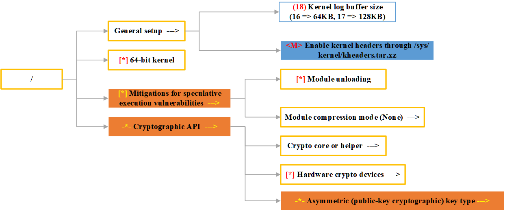

# AutoOS源码分析
## 代码结构
AutoOS主要包含三个文件
- `AutoOS.py`：AutoOS主文件，用于实现option的优化
- `append.py`：用于将优化后的option写入config中
- `menuconfig.py`：对kconfiglib库的封装，用于读取和写入kernel配置空间
## AutoOS主代码分析
### 关键变量
关键参数的设置基于AutoOS使用的[背景技术](./ubuntu_with_autoos.md#技术背景)
#### LLM：key和module
key和module由用户自行获取，用于访问LLM。市场上的LLM应该都支持openai的接口，仅需修改module并提供key即可切换LLM。
#### 优化目标：a_counter, prompt_cycle和target prompt
- `a_counter`：AutoOS会通过counter.txt文件存储，记录了当前AutoOS的优化轮数,它决定了当前优化的target类型
- `target/target_object prompt`：AutoOS的优化目标，目前[target基于UnixBench的八个测试项目设置](./ubuntu_with_autoos.md#评估方法unixbench)，它们分别存储在target_list/target_object_list(target和target_object基本一致)
- `prompt_cycle`：target的种类，它和a_counter共同确定本轮优化的target

`target_(object_)list[a_counter % prompt_cycle]`即本轮优化的target，**这说明AutoOS每轮优化仅基于一个target进行**
#### 配置空间管理
在遍历内核配置空间时，整个内核空间被分为了7类配置：
- `option结点`：AutoOS为用单独的字典存储一类option信息，如(mul/val/bi/tri)xuanxiang字典
  - `value option`：需要填入值的option，包括数值型和字符串型，如sysclock，以`()`形式开头
  - `bin-state option`：两态option，以`{*}/{M}`形式开头
  - `tri-state option`：三态option，以`<*>/<>/<M>`形式开头
  - `choices/multi option`：以`-*-`形式开头。和其它option不同，choices有`assignable`的options，这些option也要交给LLM进行判断。
  - `normal option`：标准option，以`[*]/[]`形式开头(**部分normal option有类似menu的职能，AutoOS将其归类为`sub option`**)
- `menu结点`：menu管理了与某个机制相关的一类特性，一般自身不可配置。AutoOS使用caidan字典存储当前配置层下所有的caidan结点，同时使用caidan_pool存储LLM建议的需要进一步访问菜单。通常`开头为空`
- `sub option结点`：`sub option`既有normal option自身可配置的特点，也有menu option管理一类子option的特点。**它和choices option很类似，不同在于sub option本身可被配置而choices option不行**。

按照kconfig的语法分类的话，所有的option会被分为两类：
- symbol：symbol 是 Kconfig 系统中用于表示配置选项的基本元素。它可以是各种类型，如布尔（bool）、三态（tristate）、字符串（string）、十六进制（hex）、整数（int）等。
- choices：choice 是一种特殊的配置结构，用于将多个类似的配置选项组合在一起，使用户可以从中选择一个或多个选项。
#### option prompt
AutoOS通过预设的`option prompt + target prompt + 实际的option`拼接成最终的向LLM发起请求的prompt。

menu/value/bin-state/tri-state/choices option的prompt长的差不多，主要在规范输出格式，normal/sub option共用prompt，在直接拼接option到最终的prompt上之前，需要先通过pre prompt向LLM提供额外的上下文以适应sub option的结构。

同时，因为LLM的幻觉问题，AutoOS不仅要求LLM对提供的option对target的影响进行预测，还要求其对自己的预测进行`自解释`，即要求LLM解释自己的预测结果，确保预测和解释的一致性。
#### visibility（强烈建议先了解Kconfig语法）
`visibility`：Kconfig中每个option通常使用`"depends on" <expr>`指定依赖，option默认情况下是`visible`的，当dependence无法满足时，当前option就是`invisible`。

Kconfig中一个表达式的值可以为`n/m/y`（或者分别为`0/1/2`用于计算）。当表达式的结果为`m/y`时，菜单项才可见。猜测AutoOS中`visibility`和Kconfig保持一致，**当visibility=1/2，即y/m时，option才是visible的**。

kconfiglib提供能够帮助用户获取配置的visibility。AutoOS将symbol和choice的visibility分开计算。并且使用了独立的字典存储symbol/choices的invisible/visible的转换。
#### 优化结果
[AutoOS会为option打上tag](./ubuntu_with_autoos.md#配置修改)，不同tag的option会被存储到不同的字典和文件中进行存储。其中：
- `result/final result`：当前option被修改，且其visibility = 1/2(变为Y/M)
- `result1/invisible`：当前option如果被修改，且其visibility = 0(变为了N)
- `result2/origin`：当前option如果被修改，则存储其origin config
- `result not changed`：LLM建议与当前一致的option
- `normal/sub option`：normal和sub option有额外的记录
  - `inc`：记录被LLM预测为increase的option
  - `dec`：记录被LLM预测为decrease的option
### 具体流程

AutoOS论文介绍了几个工作的阶段,我们结合源码解释几个阶段如何实现。注意**observing/pruning/proposing/acting stage的单位是配置层**，会在整个优化过程中不断重复。简单来说，就是通过BFS遍历配置空间，判断每个option对target的影响的过程。
#### observing stage
observing stage主要是获取当前配置层的option并进行分类

首先，获取当前目录(和kernel源码目录不同,这里是配置空间的根目录,即通过menuconfig看到的东西)下所有option，如下图我们以根目录为例展示配置空间结构：

然后按照以下规则进行分类：
- symbol：
   - `value/bin-state/tri-state option`：value option依赖其配置前`({number})`匹配(**字符类型的value option没考虑，可能与性能关系不大？**)，bin-state依赖`{*}/{M}`，tri-state依赖`<*>/<>/<M>`，字典中直接存储`<option, state>`的关系。
   - `normal option`：依赖`[]/[*]`进行匹配，匹配成功存入字典`<option, state>`
   - `sub option`：
     - 首先依赖`[]`进行匹配(**在sub option中的必定在normal option中**)，然后通过menuconfig获取所有的`assignable options`。
     - 检查所有`assignable options`，如果所有`assignable options`都是normal option，则视为sub option，否则视为menu option。字典中存储的`<option, <assignable option, state>>`
   - `menu option`：
     - 如果`''`匹配成功则将option加入字典，字典中存储`<option, state>`
     - 参考`choices option`部分
     - 参考`sub option`部分
- choices：
  - `choices option`：
     - 首先会依赖`-*-`进行匹配，然后通过menuconfig获取所有`assignable options`
     - 然后判断其中是否存在option为`menu option`(通过结尾的`--->`)，如果有则视为choices option, 否则视为menu option。字典中存储的是`<option, <assignable option, state>>`

这部分的描述实际遵循Kconfig的语法，[这个文档有较详细的介绍，可以参考]()
#### pruning stage
剪枝阶段主要希望通过LLM快速筛选对target没有影响的`menu option`以缩小配置空间，提高效率。

observing stage已将所有的`menu option`放入了caidan字典中。pruning stage首先会将字典中所有的menu option以及menu option prompt拼接为一个prompt，要求LLM按照指定格式对当前所有的menu option进行预测和解释，预测哪个menu option可能对target有影响。(AutoOS论文中提到会有帮助LLM学习当前kernel配置空间的过程，但是似乎没有对应实现。仅发现在最初两层配置层中使用的menu option prompt是first prompt，但是内容上与后续的menu option prompt差别不大，尚不清楚其意义)

当LLM根据要求返回option之后，AutoOS会将返回的menu option通过正则表达式拆分，重新插入caidan_pool字典中，作为BFS的下轮起点(论文中称其为Dynamic Tree Traversal With Certain Randomness，**随机性体现在LLM每次的预测结果有一定随机性**)。
#### proposing stage
proposing stage是AutoOS的核心，它的目标是通过LLM预测当前config