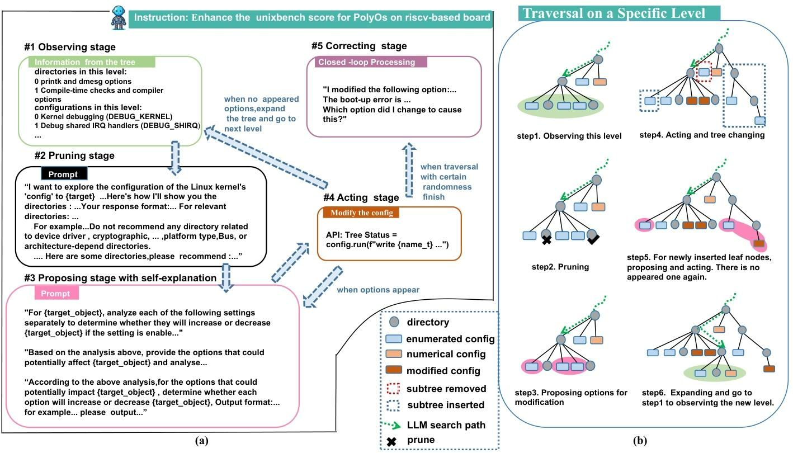

# 在Ubuntu上使用AutoOS优化kernel
## 环境
- 硬件：(VMware 17.5 pro on Windows x86) 
    - CPU：8core i5-11400H@2.70GHz
    - MEM：16 GB
    - DISK：128 GB
- OS：Ubuntu 22.04.5 Server 
## Ubuntu启动相关文件
Ubuntu启动时最重要的目录是`/boot`，它包含了启动系统所需的核心文件，boot目录下包括这些文件：
- **`KVERSION`**(**内核版本号**)(**以下变量在kernel srccode根目录下的Makefile开头定义**)=**`VERSION` + `PATCHLEVEL` + `SUBLEVEL` + `EXTRAVERSION`**，我们可以通过修改`EXTRAVERSION`对修改的kernel进行标识。
- `config-{KVERSION}`：对应kversion的内核配置文件，包含了当前发行版编译内核时使用的配置选项(**即内核编译和autoos优化的config base)**。
- `initrd.img-{KVERSION}`：对应kversion的初始内存文件系统映像
- `vmlinuz-{KVERSION}`：对应kversion压缩的Linux内核映像，通常在启动时被加载。
- `System.map-{KVERSION}`：对应kversion内核符号表，用于调试。
- `grub目录`：GRUB（GRand Unified Bootloader）的配置文件和相关文件(需要注册新的kernel到GRUB配置文件中以确保目标kernel能被GRUB引导启动)。

另外一个关键目录是`/lib/modules`，如果编译内核时启用了`MODULES`(在`kernel/module/Kconfig`中)，则大部分驱动会以`可加载模块(.ko)`的形式存放在`/lib/modules/{KVERSION}`目录下，OS在启动过程中会获取和加载必要的modules确保OS能够正常管理设备(尤其是磁盘，如果缺少对应驱动系统无法启动)

## 构建基线kernel
构建kernel需要这几个东西：**kernel源码 + 发行版对应的kernel config** + 构建环境。我们将**未经AutoOS优化的config称为`基线config`，其编译的内核称为`基线kernel`**，所以我们第一步首先是构建`基线kernel`并进行测试。
### 获取kernel源码和config
我们首先要确定当前发行版支持的内核版本范围，比如下图是Ubuntu各发行版和支持的内核版本间的关系。可以通过`uname -r`查看当前内核版本。

- `获取源码`：确定支持的内核版本范围后，最好的方法是直接通过`包管理器`获取当内核源代码(对应内核版本一定支持)，执行命令
    ```
    apt list | grep linux-source
    ```
获取可以下载的内核代码，这里我们选择安装`VERSION=6.2.0`版本源码。


- `获取config`：通过apt拉取的源码是纯净的源码，没有Ubuntu相关的配置。**之所以要使用Ubuntu的config，是因为我们不仅需要构建内核，还需要确保该内核一定能够支持当前Ubuntu发行版，并且考虑到AutoOS优化结果应该和人工调整过的config进行对比才有价值**。这里同样建议使用`包管理器`通过安装新的内核镜像来获取config文件(从`boot目录`下)。使用命令
    ```
    export VERSION=6.2.0
    apt list | grep linux-image-${VERSION}
    ```
    Ubuntu默认使用的是`generic`通用镜像，我们也选择一个`generic镜像`进行安装，完成安装之后，可以在`boot目录`下找到`config-{VERSION}-generic`，这个就是我们需要的config。
### 配置构建环境
接下来我们需要拉取构建内核需要的工具，执行以下命令：
```
sudo apt install make gcc g++ binutils build-essential bc python3 bison flex rsync libelf-dev libssl-dev libncurses-dev dwarves
```
因为不同环境上已有依赖差别较大，如果还缺少依赖可以按照提示继续安装
### 编译内核(注意)
**根据AutoOS的优化逻辑，需要将所有的配置归一化(存疑？)，因此需要禁用`Linux内核模块化功能(MODULES)`,使用和其它功能相同的逻辑管理内核模块的启用情况**。所以首先修改源码目录下的`kernel/module/Kconfig`文件，删除下面部分
```
menuconfig MODULES
           bool "Enable loadable module support"
           modules
           help
             Kernel modules are small pieces of compiled code which can
             be inserted in the running kernel, rather than being
             permanently built into the kernel.  You use the "modprobe"
             tool to add (and sometimes remove) them.  If you say Y here,
             many parts of the kernel can be built as modules (by
             answering M instead of Y where indicated): this is most
             useful for infrequently used options which are not required
             for booting.  For more information, see the man pages for
             modprobe, lsmod, modinfo, insmod and rmmod.
   
             If you say Y here, you will need to run "make
             modules_install" to put the modules under /lib/modules/
             where modprobe can find them (you may need to be root to do
             this).
   
             If unsure, say Y.
```
然后执行命令(**注意修改Makefile中的EXTRAVERSION以区分编译的内核版本**)
```
# 在内核源码目录下执行
cp /boot/config-{VERSION}-generic ./.config
# 清理配置和编译缓存
make clean && make mrproper && make distclean
# 因为关闭了modules，所以不需要在make install前执行make modules_install
make -j16 && make install
```
当编译完成之后就可以在`boot目录`下看到我们新编译的内核相关文件了，**注意为了方便选择内核版本，需要修改`/etc/default/grub`下图红框中的内容，然后运行`update-grub`**。再次启动时可以选择使用的内核镜像。


## 使用AutoOS优化config
[具体的AutoOS项目和论文解析见这个文档](./autoos_srccode.md)。这里仅进行简单说明。
### 技术背景
#### 评估方法：UnixBench
UnixBench的测试包括两个方面：
- `单CPU/单线程测试`：测试执行单个任务时的性能表现
- `全CPU/多线程测试`：测试并行处理的能力

每个方面都是基于以下八个测试项目进行：
- `Dhrystone测试`：聚焦在字符串处理能力，没有浮点运算操作。用于测试链接器编译、代码优化、内存缓存、等待状态和整数数据类型等。
- `Whetstone测试`：用于测试浮点运算效率和速度，包含科学计算的典型性能模块，如C语言中的sin、cos、sqrt等数学函数，以及数组访问、条件分支和过程调用等操作。
- `Execl Throughput测试`：衡量系统的整体性能，通过创建子进程并调用exec系统调用来测试系统的进程创建和执行性能。
- `文件复制测试`：衡量文件数据从一个文件被传输到另一个文件的性能，使用大量的缓存。
- `Pipe Throughput测试`：测试在一秒钟内一个进程写512比特到一个管道中并且读回来的次数，衡量管道吞吐量。
- `Pipe-based Context Switching测试`：衡量两个进程通过管道交换递增整数的次数，类似于现实世界中的应用程序。
- `Process Creation测试`：衡量一个进程能产生子线程并且立即退出的次数，直接关系到内存带宽。
- `Shell Scripts测试`：衡量在一分钟内，一个进程可以启动并停止shell脚本的次数，通常会测试1，2，3，4，8个shell脚本的共同拷贝。
#### 内核配置：结构
如果将整个内核配置空间视为树，AutoOS将配置分为两类节点，叶节点是实际的配置选项，中间节点是菜单选项，表征了一类节点。
- `中间节点/菜单选项`：这类选现表征了一类配置，用于帮助用户快速索引具体的配置项，如下图中的`File System`等。


- `叶节点`：AutoOS将叶节点分为了以下几类
  - `1.标准配置项`：通过`Y/N`决定是否开启的特性，如是否启用`High Resolution Timer Support (HRTimer)`特性
  - `2.多选一配置项`：当前特性有多种实现，需要选择一种实现，最典型的就是`选择ARCH`
  - `多元配置项`：为了提高系统灵活性，当前特性可以选择built-in(编译在内核中)/modules(编译为可加载模块)
    - `3.二元配置项`：特性一定启用，仅决定是`ON(built-in)`/`M(modules)`
    - `4.三元配置项`：特性可关闭，可以决定是`N(disable)`/`ON(built-in)`/`M(modules)`
  - `5.数值配置项`：配置实际上是一个数值，如`Maximum Threads per Process (10=>20 20=>50) (thread_num) (20)`,用于控制一个进程最多可以拥有的线程数
### 建模
AutoOS将整个内核配置空间视为一个`tree`，视为集合$T=(N, E)$，$N$为节点（配置选项），$E$为节点间关系。同时定义了两个配置子集：
    - `最优性能子集`$L_g$：对于优化目标$P$(**即UnixBench分数最高**)，存在$L_g\subseteq N$，使得$P$最高。
    - `启动问题相关集合`$K$：$K\subseteq N$，$\forall k\in K$,使能$k\Rightarrow$系统无法正常启动(**是否存在多个$k$相互影响导致系统出错？**)。
    - `评估函数`：$f: 2^N\rightarrow\mathbb{R}$(**显然对所有子集都会有一个UnixBench分数，即子集到实数域的映射**)
    - `目标`：找到集合$M$使$f(M)$最大，满足$M\approx L_g$且$M\cap K=\emptyset$(**即求解的集合$M$应该尽可能接近最优配置，并且不包含影响系统启动的参数，是否过于简单？**)

通俗来讲，我们需要求解一套配置方案，这套方案要避免修改影响系统启动的配置，并且尽可能接近理论性能最优的配置方案(**在这里性能等价于UnixBench分数，分数越高，性能越好**)。整个求解过程实际上是在遍历`配置空间这个树`，对每个配置判断是否会影响UnixBench分数，以及是否会影响系统的正常启动。

**因此整个问题的关键在于:如何快速筛选对UnixBench分数有影响的配置，并判断配置的影响是正向/负向，同时避免修改影响系统启动的配置？**
### 技术路线

技术路线的核心是将判断交给`LLM`，由LLM根据其内部知识判断`config <=> target`的关系。对整个配置空间的访问方法基本可以视为BFS，每轮循环处理当前层，一轮循环至少包含以下步骤。
#### 训练LLM
(**论文说会先将完整的配置空间信息告知LLM，但是没有找到对应的实现？**)
#### 快速筛选
- config：所有中间结点/菜单及其子树
- target：性能无关/影响系统启动

快速筛选的目标是尽可能筛掉符合`target`的`config`以**减少后续工作量**.AutoOS基于`python kconfiglib`封装出了`MenuConfig类`.通过读取`Kconfig文件`获取配置空间中的节点信息(**尤其是类型item**)。

AutoOS会检查`item == MENU`的配置节点$n_i$，即前文提到的中间节点，要求`LLM根据其内部的知识`给出一个概率$P(p|n_i)$，表征该节点影响target的可能性，由LLM基于知识和随机性选择是否保留该中间结点(**没有看到对应的实现？**)。**如果当前中间结点保留**，则会加入到FIFO的`菜单列表`中，用于继续访问下一层。
#### 判断配置影响
- config：所有叶结点
- target：UnixBench的测试项目

完成筛选之后，AutoOS开始重新检查当前层的所有叶节点。如[评估方法所说](#评估方法unixbench)，UnixBench基于8个测试项目测试性能。AutoOS将8个项目抽象为8个`target`，并且为每个target设计专有的`prompt`，要求`LLM基于其内部的知识`以这些`target`作为标准,判断当前config对性能造成的影响，并且返回意见，**即当前config会increase/decrease性能**。

同时，为了应对**LLM的预测结果与解释不一致**的问题，AutoOS采用了`自解释机制`，即要求LLM对自己的预测进行详细的解释，确保预测和解释的一致性。
#### 配置修改
AutoOS通过以下标记区分options：
- `changed/unchanged`：LLM推荐与原配置不同的option标记为changed，反之标记为unchanged。
- `visibility`：在快速筛选过程中中间结点被剪掉会导致子树中的option被禁用，某些对该子树有依赖的option也会受到影响被禁用，这就导致了优化前/后有些option的`visibility`会改变。AutoOS会根据visibility的改变决定对option的操作(**实现中对这部分表述较混乱，尚不清楚它是如何计算和使用visibility**)
- `increase/decrease`：LLM标记的当前option对性能的影响。

基于这些标记，AutoOS将所有option分为了以下几类：
- `final result`： `changed`&`visibility满足特定要求`的option，存储在result和output.txt
- `invisible result`：`visibility变为不可见`的option，存储在result1
- `original result`：`changed`的option的原始值，存储在result2和output1.txt
- `unchanged option`：`unchange`的option，存储在result_notchange和output3.txt
- `increased/decreased option`：所有被LLM标记为increase/decrease的option，分别存储在inc和inc.txt/dec和dec.txt中。

`final result`是最终会被使用的option输出，在完成优化之后通过AutoOS将优化的option添加到.config中。
#### 修正
AutoOS基于LLM内置的知识判断判断结点是否保留，但是并不完全可靠。因此如果存在导致了严重错误的option，论文中有一个新的修正阶段，通过和LLM进一步交互时期修复相关option，**但是目前没有看到相关的代码实现**。

## 测试
我们测试使用的环境如下：
- `distribution`：Ubuntu 22.04.5 Server
- `kernel version`：Linux 6.2.0
- `基线配置`：Ubuntu config-6.2.0-060200-generic
- `LLM`：论文中使用的chargpt-3.5-turbo，我们测试时使用的qwen
### 测试结果
测试使用UnixBench，下面是在`基线kernel`上的测试结果：
```
   BYTE UNIX Benchmarks (Version 5.1.3)

   System: c: GNU/Linux
   OS: GNU/Linux -- 6.2.16-origin620 -- #7 SMP PREEMPT_DYNAMIC Fri Dec  6 18:34:35 UTC 2024
   Machine: x86_64 (x86_64)
   Language: en_US.utf8 (charmap="UTF-8", collate="UTF-8")
   CPU 0: 11th Gen Intel(R) Core(TM) i5-11400H @ 2.70GHz (5376.0 bogomips)
          x86-64, MMX, Physical Address Ext, SYSENTER/SYSEXIT, SYSCALL/SYSRET
   CPU 1: 11th Gen Intel(R) Core(TM) i5-11400H @ 2.70GHz (5376.0 bogomips)
          x86-64, MMX, Physical Address Ext, SYSENTER/SYSEXIT, SYSCALL/SYSRET
   CPU 2: 11th Gen Intel(R) Core(TM) i5-11400H @ 2.70GHz (5376.0 bogomips)
          x86-64, MMX, Physical Address Ext, SYSENTER/SYSEXIT, SYSCALL/SYSRET
   CPU 3: 11th Gen Intel(R) Core(TM) i5-11400H @ 2.70GHz (5376.0 bogomips)
          x86-64, MMX, Physical Address Ext, SYSENTER/SYSEXIT, SYSCALL/SYSRET
   CPU 4: 11th Gen Intel(R) Core(TM) i5-11400H @ 2.70GHz (5376.0 bogomips)
          x86-64, MMX, Physical Address Ext, SYSENTER/SYSEXIT, SYSCALL/SYSRET
   CPU 5: 11th Gen Intel(R) Core(TM) i5-11400H @ 2.70GHz (5376.0 bogomips)
          x86-64, MMX, Physical Address Ext, SYSENTER/SYSEXIT, SYSCALL/SYSRET
   CPU 6: 11th Gen Intel(R) Core(TM) i5-11400H @ 2.70GHz (5376.0 bogomips)
          x86-64, MMX, Physical Address Ext, SYSENTER/SYSEXIT, SYSCALL/SYSRET
   CPU 7: 11th Gen Intel(R) Core(TM) i5-11400H @ 2.70GHz (5376.0 bogomips)
          x86-64, MMX, Physical Address Ext, SYSENTER/SYSEXIT, SYSCALL/SYSRET
   09:47:09 up 20 min,  2 users,  load average: 0.07, 0.03, 0.09; runlevel 2024-12-07

------------------------------------------------------------------------
Benchmark Run: Sat Dec 07 2024 09:47:09 - 10:15:09
8 CPUs in system; running 1 parallel copy of tests

Dhrystone 2 using register variables       54329615.1 lps   (10.0 s, 7 samples)
Double-Precision Whetstone                     8576.2 MWIPS (9.9 s, 7 samples)
Execl Throughput                                592.1 lps   (30.0 s, 2 samples)
File Copy 1024 bufsize 2000 maxblocks         64094.4 KBps  (30.0 s, 2 samples)
File Copy 256 bufsize 500 maxblocks           16325.5 KBps  (30.0 s, 2 samples)
File Copy 4096 bufsize 8000 maxblocks        247401.4 KBps  (30.0 s, 2 samples)
Pipe Throughput                               68223.8 lps   (10.0 s, 7 samples)
Pipe-based Context Switching                   8917.5 lps   (10.0 s, 7 samples)
Process Creation                               2134.6 lps   (30.0 s, 2 samples)
Shell Scripts (1 concurrent)                   3428.4 lpm   (60.0 s, 2 samples)
Shell Scripts (8 concurrent)                   1786.7 lpm   (60.0 s, 2 samples)
System Call Overhead                          30236.6 lps   (10.0 s, 7 samples)

System Benchmarks Index Values               BASELINE       RESULT    INDEX
Dhrystone 2 using register variables         116700.0   54329615.1   4655.5
Double-Precision Whetstone                       55.0       8576.2   1559.3
Execl Throughput                                 43.0        592.1    137.7
File Copy 1024 bufsize 2000 maxblocks          3960.0      64094.4    161.9
File Copy 256 bufsize 500 maxblocks            1655.0      16325.5     98.6
File Copy 4096 bufsize 8000 maxblocks          5800.0     247401.4    426.6
Pipe Throughput                               12440.0      68223.8     54.8
Pipe-based Context Switching                   4000.0       8917.5     22.3
Process Creation                                126.0       2134.6    169.4
Shell Scripts (1 concurrent)                     42.4       3428.4    808.6
Shell Scripts (8 concurrent)                      6.0       1786.7   2977.9
System Call Overhead                          15000.0      30236.6     20.2
                                                                   ========
System Benchmarks Index Score                                         252.9

------------------------------------------------------------------------
Benchmark Run: Sat Dec 07 2024 10:15:09 - 10:43:14
8 CPUs in system; running 8 parallel copies of tests

Dhrystone 2 using register variables      337907394.4 lps   (10.0 s, 7 samples)
Double-Precision Whetstone                    65899.4 MWIPS (9.9 s, 7 samples)
Execl Throughput                               4464.9 lps   (29.9 s, 2 samples)
File Copy 1024 bufsize 2000 maxblocks        491403.5 KBps  (30.0 s, 2 samples)
File Copy 256 bufsize 500 maxblocks          125615.0 KBps  (30.0 s, 2 samples)
File Copy 4096 bufsize 8000 maxblocks       1885675.5 KBps  (30.0 s, 2 samples)
Pipe Throughput                              519289.6 lps   (10.0 s, 7 samples)
Pipe-based Context Switching                  69059.2 lps   (10.0 s, 7 samples)
Process Creation                              17794.3 lps   (30.0 s, 2 samples)
Shell Scripts (1 concurrent)                  15466.0 lpm   (60.0 s, 2 samples)
Shell Scripts (8 concurrent)                   2105.3 lpm   (60.1 s, 2 samples)
System Call Overhead                         218374.1 lps   (10.0 s, 7 samples)

System Benchmarks Index Values               BASELINE       RESULT    INDEX
Dhrystone 2 using register variables         116700.0  337907394.4  28955.2
Double-Precision Whetstone                       55.0      65899.4  11981.7
Execl Throughput                                 43.0       4464.9   1038.3
File Copy 1024 bufsize 2000 maxblocks          3960.0     491403.5   1240.9
File Copy 256 bufsize 500 maxblocks            1655.0     125615.0    759.0
File Copy 4096 bufsize 8000 maxblocks          5800.0    1885675.5   3251.2
Pipe Throughput                               12440.0     519289.6    417.4
Pipe-based Context Switching                   4000.0      69059.2    172.6
Process Creation                                126.0      17794.3   1412.2
Shell Scripts (1 concurrent)                     42.4      15466.0   3647.7
Shell Scripts (8 concurrent)                      6.0       2105.3   3508.9
System Call Overhead                          15000.0     218374.1    145.6
                                                                   ========
System Benchmarks Index Score                                        1560.9
```
这是经过`AutoOS一轮优化`的kernel的测试结果，看起来是反向优化了。
```
   BYTE UNIX Benchmarks (Version 5.1.3)

   System: c: GNU/Linux
   OS: GNU/Linux -- 6.2.16-l1 -- #1 SMP Sat Dec  7 07:37:07 UTC 2024
   Machine: x86_64 (x86_64)
   Language: en_US.utf8 (charmap="UTF-8", collate="UTF-8")
   CPU 0: 11th Gen Intel(R) Core(TM) i5-11400H @ 2.70GHz (5376.0 bogomips)
          x86-64, MMX, Physical Address Ext, SYSENTER/SYSEXIT, SYSCALL/SYSRET
   CPU 1: 11th Gen Intel(R) Core(TM) i5-11400H @ 2.70GHz (5376.0 bogomips)
          x86-64, MMX, Physical Address Ext, SYSENTER/SYSEXIT, SYSCALL/SYSRET
   CPU 2: 11th Gen Intel(R) Core(TM) i5-11400H @ 2.70GHz (5376.0 bogomips)
          x86-64, MMX, Physical Address Ext, SYSENTER/SYSEXIT, SYSCALL/SYSRET
   CPU 3: 11th Gen Intel(R) Core(TM) i5-11400H @ 2.70GHz (5376.0 bogomips)
          x86-64, MMX, Physical Address Ext, SYSENTER/SYSEXIT, SYSCALL/SYSRET
   CPU 4: 11th Gen Intel(R) Core(TM) i5-11400H @ 2.70GHz (5376.0 bogomips)
          x86-64, MMX, Physical Address Ext, SYSENTER/SYSEXIT, SYSCALL/SYSRET
   CPU 5: 11th Gen Intel(R) Core(TM) i5-11400H @ 2.70GHz (5376.0 bogomips)
          x86-64, MMX, Physical Address Ext, SYSENTER/SYSEXIT, SYSCALL/SYSRET
   CPU 6: 11th Gen Intel(R) Core(TM) i5-11400H @ 2.70GHz (5376.0 bogomips)
          x86-64, MMX, Physical Address Ext, SYSENTER/SYSEXIT, SYSCALL/SYSRET
   CPU 7: 11th Gen Intel(R) Core(TM) i5-11400H @ 2.70GHz (5376.0 bogomips)
          x86-64, MMX, Physical Address Ext, SYSENTER/SYSEXIT, SYSCALL/SYSRET
   08:01:45 up 0 min,  1 user,  load average: 2.64, 0.97, 0.35; runlevel 2024-12-07

------------------------------------------------------------------------
Benchmark Run: Sat Dec 07 2024 08:01:45 - 08:29:46
8 CPUs in system; running 1 parallel copy of tests

Dhrystone 2 using register variables       54553602.6 lps   (10.0 s, 7 samples)
Double-Precision Whetstone                     8584.9 MWIPS (9.9 s, 7 samples)
Execl Throughput                                600.7 lps   (30.0 s, 2 samples)
File Copy 1024 bufsize 2000 maxblocks         66614.8 KBps  (30.0 s, 2 samples)
File Copy 256 bufsize 500 maxblocks           16477.5 KBps  (30.0 s, 2 samples)
File Copy 4096 bufsize 8000 maxblocks        249552.7 KBps  (30.0 s, 2 samples)
Pipe Throughput                               69145.4 lps   (10.0 s, 7 samples)
Pipe-based Context Switching                   8425.1 lps   (10.0 s, 7 samples)
Process Creation                               2090.5 lps   (30.0 s, 2 samples)
Shell Scripts (1 concurrent)                   3255.1 lpm   (60.0 s, 2 samples)
Shell Scripts (8 concurrent)                   1807.7 lpm   (60.0 s, 2 samples)
System Call Overhead                          29031.1 lps   (10.0 s, 7 samples)

System Benchmarks Index Values               BASELINE       RESULT    INDEX
Dhrystone 2 using register variables         116700.0   54553602.6   4674.7
Double-Precision Whetstone                       55.0       8584.9   1560.9
Execl Throughput                                 43.0        600.7    139.7
File Copy 1024 bufsize 2000 maxblocks          3960.0      66614.8    168.2
File Copy 256 bufsize 500 maxblocks            1655.0      16477.5     99.6
File Copy 4096 bufsize 8000 maxblocks          5800.0     249552.7    430.3
Pipe Throughput                               12440.0      69145.4     55.6
Pipe-based Context Switching                   4000.0       8425.1     21.1
Process Creation                                126.0       2090.5    165.9
Shell Scripts (1 concurrent)                     42.4       3255.1    767.7
Shell Scripts (8 concurrent)                      6.0       1807.7   3012.8
System Call Overhead                          15000.0      29031.1     19.4
                                                                   ========
System Benchmarks Index Score                                         251.4

------------------------------------------------------------------------
Benchmark Run: Sat Dec 07 2024 08:29:46 - 08:57:51
8 CPUs in system; running 8 parallel copies of tests

Dhrystone 2 using register variables      312645955.5 lps   (10.0 s, 7 samples)
Double-Precision Whetstone                    63094.5 MWIPS (10.1 s, 7 samples)
Execl Throughput                               4135.0 lps   (30.0 s, 2 samples)
File Copy 1024 bufsize 2000 maxblocks        476498.2 KBps  (30.0 s, 2 samples)
File Copy 256 bufsize 500 maxblocks          120592.0 KBps  (30.0 s, 2 samples)
File Copy 4096 bufsize 8000 maxblocks       1802241.0 KBps  (30.0 s, 2 samples)
Pipe Throughput                              500173.1 lps   (10.0 s, 7 samples)
Pipe-based Context Switching                  67066.3 lps   (10.0 s, 7 samples)
Process Creation                              16126.0 lps   (30.0 s, 2 samples)
Shell Scripts (1 concurrent)                  14583.9 lpm   (60.0 s, 2 samples)
Shell Scripts (8 concurrent)                   2016.8 lpm   (60.1 s, 2 samples)
System Call Overhead                         211786.6 lps   (10.0 s, 7 samples)

System Benchmarks Index Values               BASELINE       RESULT    INDEX
Dhrystone 2 using register variables         116700.0  312645955.5  26790.6
Double-Precision Whetstone                       55.0      63094.5  11471.7
Execl Throughput                                 43.0       4135.0    961.6
File Copy 1024 bufsize 2000 maxblocks          3960.0     476498.2   1203.3
File Copy 256 bufsize 500 maxblocks            1655.0     120592.0    728.7
File Copy 4096 bufsize 8000 maxblocks          5800.0    1802241.0   3107.3
Pipe Throughput                               12440.0     500173.1    402.1
Pipe-based Context Switching                   4000.0      67066.3    167.7
Process Creation                                126.0      16126.0   1279.8
Shell Scripts (1 concurrent)                     42.4      14583.9   3439.6
Shell Scripts (8 concurrent)                      6.0       2016.8   3361.3
System Call Overhead                          15000.0     211786.6    141.2
                                                                   ========
System Benchmarks Index Score                                        1483.3
```
### 测试分析
- 从结果来看，优化不明显甚至有负优化，根据论文数据经过24次优化得到的效果相对较好，但是并没有明确指出24次优化是针对`同一基准config重复试错`还是`每次更新基准config进行迭代`。
- AutoOS将每个UnixBench测试项目视为一个优化的target，但是它并没有考虑多个target的综合优化问题，每轮优化仅针对一种target进行优化，优化效果有限。